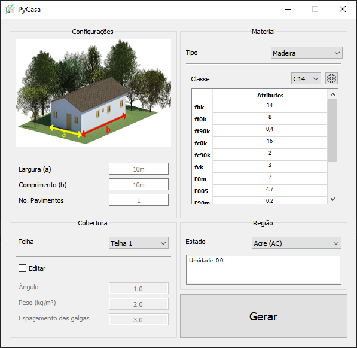
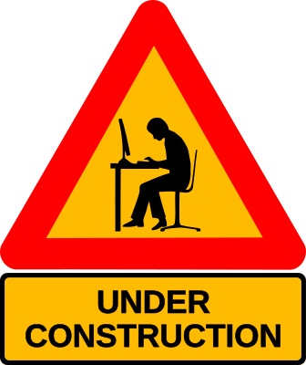

# PyCasa
O acesso à moradia adequada afeta milhões de brasileiros. Para dar suporte a edificações unifamiliares e bifamiliares, esse projeto de extensão tem o compromisso social de desenvolver aplicativos para auxiliar na escolha das dimensões dos elementos da estrutura.
O software, open-source, têm uma interface amigável para que o proprietário, mesmo que não seja especialista, consiga ter uma boa estimativa das dimensões mínimas, localização e quantidade de cada elemento estrutural da sua construção. 
Através de uma interface intuitiva, o PyCasa oferece estimativas claras e precisas, utilizando do IFC, especificação de esquema de dados aberto, e programas para visualização 3D como o DDSCad, da quantidade e dimensões mínimas de cada componente da estrutura. 
Para o caso de projetos conservadores, os aplicativos podem economizar material e melhorar o planejamento da construção. 
Por outro lado, dimensões menores que as mínimas podem implicar em casos mais graves na falha da estrutura e até mesmo em perdas de vidas.

##Recursos Principais
##### Acesso Livre: 
Todos os aplicativos desenvolvidos neste projeto estão disponíveis gratuitamente, com o objetivo de ampliar o acesso às informações essenciais para construções seguras e de qualidade.

##### Interface Amigável: 
Entendemos a importância da usabilidade, já que a moradia é uma necessidade que atravessa todos os espectros sociais. Por isso, nossos aplicativos possuem interfaces amigáveis, garantindo que proprietários, mesmo sem experiência técnica, possam utilizar as ferramentas com facilidade.

##### Otimização de Material: 
Além de promover segurança, nossos aplicativos também podem gerar economia. Nos projetos mais conservadores, eles auxiliam na otimização de materiais, contribuindo para práticas construtivas sustentáveis.

##### Segurança em Foco: 
Nós entendemos que dimensões inadequadas podem ter consequências graves. Nossos aplicativos atuam evitando riscos de falhas estruturais, reduzindo assim as chances de possíveis perdas de vidas.

##### Contribuição
Se você compartilha de nossa visão e deseja contribuir para este projeto, fique à vontade para abrir problemas (issues) e enviar solicitações de pull request. Juntos, podemos fazer a diferença na construção de um ambiente residencial mais seguro e acessível para todos os brasileiros.

###Aviso: 
Este projeto não substitui a consulta a profissionais qualificados para projetos estruturais complexos.

# Como instalar
As dependências são as seguintes:
## Dependências
     - IFCOpenShell
        pip install ifcopenshell
     - PyQt5
        pip install pyqt5
     - Algum leitor IFC, como o DDS-CAD, BIMvision, BIMcollab, etc

# Como utilizar

     

## Galeria

